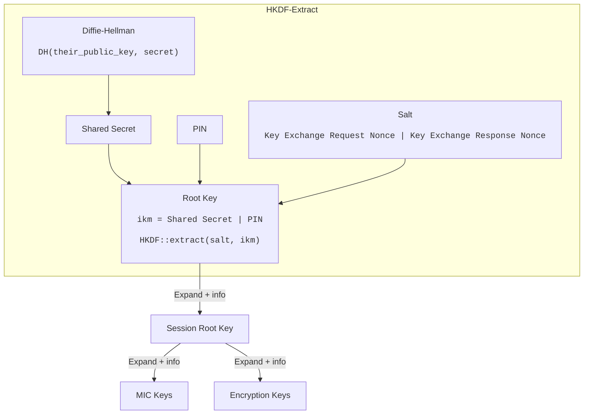

# Keys



## Key-pair

Each device and server has a life-time Curve25519 key-pair.

### Rust example

```rust
use x25519_dalek::{PublicKey, StaticSecret};

let dev_secret_key = StaticSecret::random();
let dev_pub_key = PublicKey::from(&dev_secret_key);
```

## Shared Secret

Diffie-Hellman is used for generating a shared-secret using the device and
server key-pair.

### Rust example

```rust
let shared_secret = our_secret_key.diffie_hellman(their_public_key).to_bytes();
```

## Key derivation

HKDF using the SHA256 hashing algorithm is used for deriving keys from the
shared-secret. The input parameters are described in the documentation of each
[Frame Type](../frames/index.md).

### Root Key

The _Root Key_ is extracted after completing the initial _Key Exchange_ and is
used for further key expansion. To extract the _Root Key_, the followng
parameters are used:

- IKM: `Shared Secret || PIN`

- Salt:

| 4 bytes                    | 4 bytes                     |
| -------------------------- | --------------------------- |
| Key Exchange Request Nonce | Key Exchange Response Nonce |

#### Rust example

```rust
let (root_key, _) = Hkdf::<Sha256>::extract(Some(&salt), ikm);
let root_key: [u8; 32] = root_key.try_into().unwrap();
```

### Session Root Key

The _Session Root Key_ is derived from the _Root Key_ after completing the
Activation using the following parameters:

- PRK: `Root Key`

- Info:

| 1 byte                  | 4 bytes                    | 4 bytes                     |
| ----------------------- | -------------------------- | --------------------------- |
| Key Usage Root = `0x00` | Activation Request Counter | Activation Response Counter |

#### Rust example

```rust
let mut session_root_key = [0u8; 32];
let hk = Hkdf::<Sha256>::from_prk(root_key).unwrap();
hk.expand(&info, &mut session_root_key).unwrap();
```

### Further key expansion

Other keys are derived by using the _Session Root Key_ as PRK input and using
the frame / payload specific `info`.
