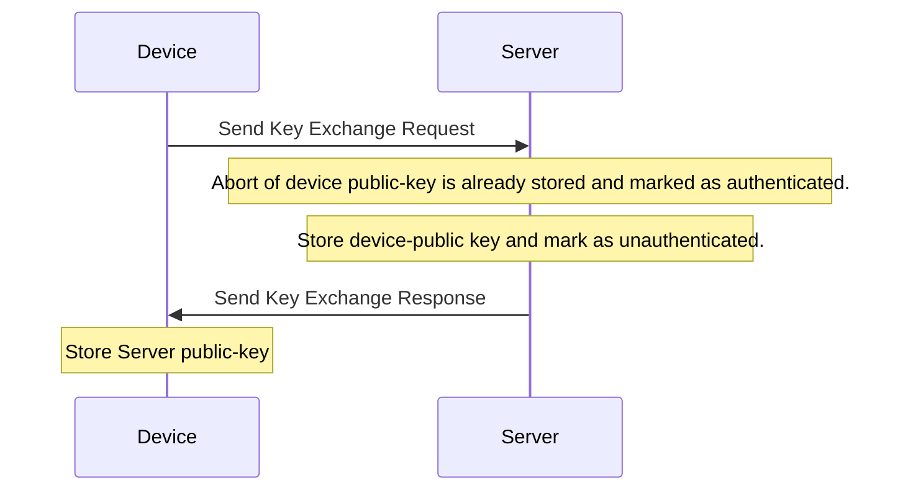
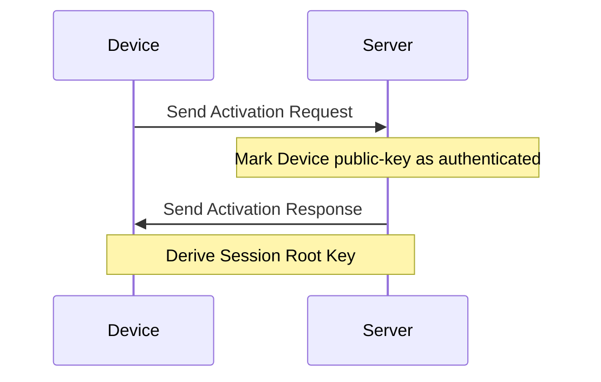

# Activation

The Activation procedure consists of two different sequences:

- Key exchange sequence (only used once to exchange public-keys)
- Join request sequence (used to establish new session-keys)

## Cryptography

The following cryptographic algorithms are used for the Activation procedure:

- Curve25519 elliptic-curve (as public-keys are only 32bytes)
- ECDH for computing shared secrets
- HKDF for signature computation

## Prerequisite

### Device EUI64

Each device must be provisioned with an unique IEEE EUI64. This provides the
device both with an OUI (mapping to the vendor) and an unique ID.

### PIN

Each device must be provisioned with an unique PIN. This PIN is used for mutual
authentication between the device and server.

### Device key-pair

Each device must be provisioned with an unique key-pair. The device can generate
this key-pair during its first boot, it can be pre-provisioned or can be
provided by a secure element. Once generated, it must be stored in the
persistent memory of the device.

### Server key-pair

Also the server must be provisioned with an unique key-pair. This key-pair must
be used for all devices that wish to pair with the server. Once generated, it
must be stored in the persistent memory of the server.

## Sequence

Before an end-device is able to join the network, its Device EUI64 and its PIN
must be configured on the server. This configuration happens out-of-band. Once
this step is completed, it will be able to join the network using the following
sequences.

### Exchange keys procedure

A device that has not stored the server public-key in its persistent memory,
first needs to exchange the public-keys with the server. The server only
responds to requests of devices for which it has not stored the device
public-key in its persistent memory.

At this point, both the device and the server have exchanged public-keys. The
device has authenticated the server as only using the shared PIN the correct
signature can be calculated. At this point, the server has not authenticated the
device. This is performed in the next step.

### Join request

Each time the device needs to generate a new session-key, it follows the
join-procedure.

The first time the server receives the join-request from the device, the server
will after succesfully validating the signature, mark the device public-key as
authenticated.

